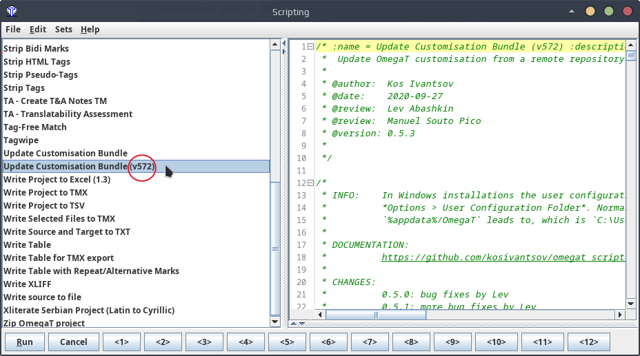
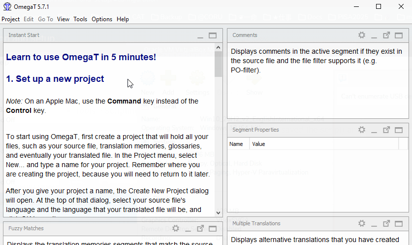

# OmegaT 5.7.2 setup guide for macOS

Carefully choose your path here:

- If there is no current installation of OmegaT in your machine, you can skip the following steps about configuration and jump directly to the [installation section](#installation). OmegaT will configure itself as part of the installation.
- If you already have a previous version (e.g. 5.7.1 or 4.2.0) of OmegaT installed, you'll have to update your configuration first: to do so please go to the [configuration section](#configuration) (next section right down below).

##  Configuration

This section applies to users that already have a previous version (e.g. 5.7.1 or 4.2.0) of OmegaT installed. Please follow the next steps to update your configuration for starteers.

1. Run OmegaT and go to **Tools** > **Scripting** to open your scripting console,  In OmegaT 5.7.1, please open the scripting console. Check whethers you have a script called "**Update Customisation Bundle (v572)**":

    !!! warning 
        If you don't see the "**v752**" bit, then it's not the script we're looking for. See next step to fetch the script.

    

    If the script "**Update Customisation Bundle (v572)**" is there, please click on it to select it and press the **Run** button (at the bottom left) to run it. The script will run to update your config files and will quit OmegaT. After that, skip the next step and jump directly to the [installation section](#installation).

    If the script is not there, go to the next step to download it.

2. Click on the button below to download the configuration script (e.g. to your Desktop)

    [ :material-download: Download UpdateConfigBundle.groovy](https://cat.capstan.be/OmegaT/v572/customization/scripts/updateConfigBundle.groovy){ .md-button .md-button--primary }

<!-- [file.ext](../static/file.ext){:download} -->

3. In OmegaT, follow these steps to run the configuration script you have downloaded:
	- **Tools** > **Scripting** > **File** > **Open script**
	- browse to your Desktop (or the folder where you have saved the script) and select the groovy file
	- press the **Open** button to open the script file and press **Run** button (on the bottom left)

    
        
    The script will install the necessary config files for OmegaT 5.7.2 and delete old config files for OmegaT 5.7.1, and after that it will quit OmegaT.

4. Uninstall your current version of OmegaT.

5. Finally, proceed now to the [installation section](#installation) (next step below).

##  Installation

1. Click on the button below to download OmegaT 5.7.2. This is a custom version prepared by cApStAn which includes several bug fixes and enhancements not available in other versions.

    [ :material-download: Download OmegaT 5.7.2](https://cat.capstan.be/OmegaT/exe/OmegaT_5.7.2_Windows_64_Signed.exe){ .md-button .md-button--primary }

2. If you're using Safari, then the file will be unzipped automatically when the download ends.​ If you use another browser, double-click the file when the download ends to unzip it.

3. A folder is created, open it to see its contents. You'll see that it contains the **OmegaT.app** file.

4. Drag the **OmegaT.app** file to the **Applications** folder.

    

        
<video playsinline="" controls="controls" poster="https://s3.amazonaws.com/media-p.slid.es/videos/1129410/Sjlk4rKG/1kx16dhvq0_thumb_00001.jpg" data-paused-by-reveal="" data-lazy-loaded="" src="https://s3.amazonaws.com/media-p.slid.es/videos/1129410/Sjlk4rKG/1kx16dhvq0.mp4"></video>

    

4. OmegaT is now installed. Go to the **Applications** folder and open **OmegaT** there.
    
5. Your Mac might ask for confirmation that you want to open it. If that's the case, please press **Open**. OmegaT will now run.

    

        
<video playsinline="" controls="controls" poster="https://s3.amazonaws.com/media-p.slid.es/videos/1129410/eXYV2O_T/oiepooibjr_thumb_00001.jpg" data-lazy-loaded="" data-paused-by-reveal="" src="https://s3.amazonaws.com/media-p.slid.es/videos/1129410/eXYV2O_T/oiepooibjr.mp4"></video>

    

11. If you want to run a post-installation check to confirm that you have the correct version, you can check that in **Help** > **About** > **Copy Support Info**. You should see: 

    > Version: OmegaT-5.7.2_0_a978d82ee   
    > Platform: [your operating system]  
    > Java: 11.0.19 amd64

You're done now. You can start using OmegaT 5.7.2. Please do not forget to [set your user name in OmegaT](#your-user-nameid).

<!-- 
To install OmegaT and set it up on a computer running Windows, please follow the OmegaT installation and setup guide below:

<iframe 
src="https://slides.com/capstan/omegat-v572-setup-guide/embed?byline=hidden&share=hidden" 
width="100%" 
height="420" 
scrolling="no" 
frameborder="0" 
webkitallowfullscreen mozallowfullscreen allowfullscreen>
</iframe>

If you use Mac or Linux, please see the second slide above or get in touch through the Helpdesk.

- USB 
16GBc
model... 
format as FAT32
D:\OmegaT
zip -- iso

https://www.westerndigital.com/products/usb-flash-drives/sandisk-ultra-fit-usb-3-1?sku=SDCZ430-016G-G46

-->