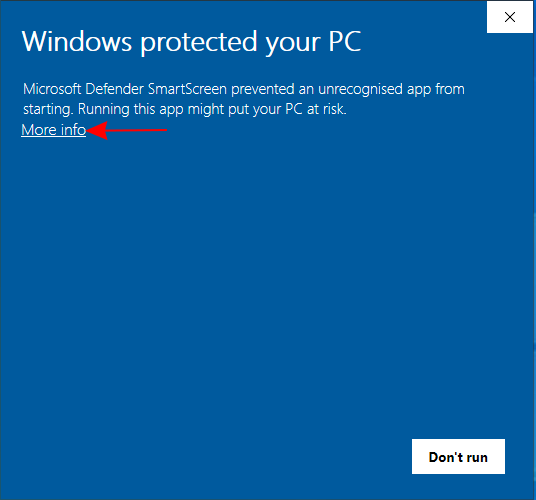
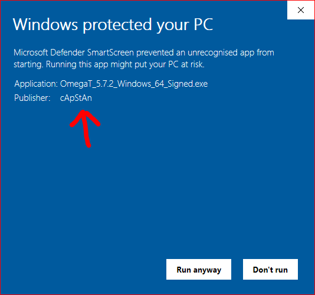

#  OmegaT 5.7.2 setup guide for Windows

??? info "Other operating systems"
    It's possible to install OmegaT 5.7.2 in other operating systems like macOS or Linux. Follow this other [guide to install on macOS](../install-and-setup-macos/). Please get in touch through the Helpdesk if you are a Linux user.

Depending on your starting point, ==choose your path here carefully==:

- IF you already have a previous version (e.g. 5.7.1 or 4.2.0) of OmegaT installed, you'll have to update your configuration first: to do so please go to the [configuration section](#configuration) (next section right down below).
- IF there is no current installation of OmegaT in your machine, you can skip the following steps about configuration and jump directly to the [installation section](#installation). OmegaT will configure itself as part of the installation.

## Configuration

This section applies to users that already have a previous version (e.g. 5.7.1 or 4.2.0) of OmegaT installed. Please follow the next steps to update your configuration.

1. Run OmegaT and go to **Tools** > **Scripting** to open your scripting console,  In OmegaT 5.7.1, please open the scripting console. Check whethers you have a script called "**Update Customisation Bundle (v572)**":

    !!! warning 
        If you don't see the "**v572**" bit, then it's not the script we're looking for. See next step to fetch the script.

    

    If the script "**Update Customisation Bundle (v572)**" is there, please click on it to select it and press the **Run** button (at the bottom left) to run it. The script will run to update your config files and will quit OmegaT. After that, skip the next step and jump directly to the [installation section](#installation).

    If the script is not there, you may download it yourself. See next steps for how to do that.

2. Right-click on the button below and select "Save Link As" to download the configuration script (e.g. to your Desktop)

    [ :material-download: Download UpdateConfigBundle.groovy](https://cat.capstan.be/OmegaT/customization/scripts/updateConfigBundle-572.groovy){ .md-button .md-button--primary }

3. In OmegaT, follow these steps to run the configuration script you have downloaded:
	- **Tools** > **Scripting** > **File** > **Open script**
	- browse to your Desktop (or the folder where you have saved the script) and select the groovy file
	- press the **Open** button to open the script file and press **Run** button (on the bottom left)

    
        
    The script will install the necessary config files for OmegaT 5.7.2 and delete old config files for OmegaT 5.7.1, and after that it will quit OmegaT.

4. Uninstall your current version of OmegaT.

5. Finally, proceed now to the [installation section](#installation) (next step below).

## Installation

!!! warning
    You must have a 64-bit machine to install OmegaT. If that's not the case, please get in touch with our Helpdesk.

1. Click on the button below to download OmegaT 5.7.2. This is a custom version prepared by cApStAn which includes several bug fixes and enhancements not available in other versions.

    [ :material-download: Download OmegaT 5.7.2](https://cat.capstan.be/OmegaT/exe/OmegaT_5.7.2_Windows_64_Signed.exe){ .md-button .md-button--primary }

    ??? question "Trouble to download?"
        Some browsers (e.g. Microsoft Edge) might ask you whether downloading the installer is safe. It is safe, and you can follow the following steps in the video below to let your browser download the file.

        

2. Double-click the installer file to start the installation wizard. 

3. Windows Defender might show a dialog warning against the risk of running an unrecognized app.
    
     <!-- # omt572-install-01.png -->s

    If you see that, click on the <u>More info</u> link in that dialog. In the information displayed you should see that cApStAn is the publisher of this installer. 
    
    

    If that's the case, prease press the **Run anyway** button to proceed with the installation.

4. In the next dialog, you may choose the language of the installation, then press **Ok**:
    
    

5. Please accept the GPL license agreement to proceed, and press **Next**:
    
    

6. OmegaT will propose the path `C:\Users\USER\AppData\Local\Programs\OmegaT` for the installation, where it should be possible for non-admin users to install. 

    !!! warning
        Please do not modify this installation path unless you're IT personnel and you know what you're doing. 

    

7. A desktop shortcut (launcher) will be created on your Desktop (which you can double-click later on to launch OmegaT). Do not uncheck that option. 
    
    

8. You may modify the name of the OmegaT folder in the start menu, but "OmegaT " is fine, no need to change it in a standard installation.

    

9. You're ready to proceed with the installation, press **Next**.

    

10. After a couple of minutes, your installation should be complete.     

    

11. If you want to run a post-installation check to confirm that you have the correct version, you can check that in **Help** > **About** > **Copy Support Info**. You should see: 

    > Version: OmegaT-5.7.2_0_a978d82ee   
    > Platform: [your operating system]  
    > Java: 11.0.19 amd64

You're done now. You can start using OmegaT 5.7.2. Please do not forget to [set your user name in OmegaT](#your-user-nameid).

<!-- 
To install OmegaT and set it up on a computer running Windows, please follow the OmegaT installation and setup guide below:

<iframe 
src="https://slides.com/capstan/omegat-v572-setup-guide/embed?byline=hidden&share=hidden" 
width="100%" 
height="420" 
scrolling="no" 
frameborder="0" 
webkitallowfullscreen mozallowfullscreen allowfullscreen>
</iframe>

If you use Mac or Linux, please see the second slide above or get in touch through the Helpdesk.

- USB 
16GBc
model... 
format as FAT32
D:\OmegaT
zip -- iso

https://www.westerndigital.com/products/usb-flash-drives/sandisk-ultra-fit-usb-3-1?sku=SDCZ430-016G-G46

-->
