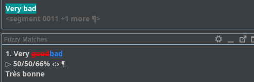

# Using matches

When you translate, your translations are saved in the working TM of the project. When you open a segment that is similar to one that has already been translated, you will see suggestions appearing in the **Matches** pane. 

The source text in the **Matches** pane uses “track changes” mode to show the difference (e.g. {~~old~>new~~}) between the new source text in the active segment and the source text in the fuzzy match selected.

  * Parts that do not appear in the active segment are {~~stricken through~>~~}
  * Parts that appear in the match are {~~~>underlined~~} <!-- ^^underlined^^ -->

    <!--  -->
    
    <!-- normalize text size in screenshots -->

When there are several matches for a segment, they are sorted by their similarity to the new segment. The active match is the one in **bold**. By default, it will be the first one in the list. If you want to use a different match, **double click** on it to activate it. 

To insert the match in full, press ++ctrl+i++ on your keyboard. After inserting it, do not forget to make the necessary changes, if appropriate, so that it fits the segment you are translating.

Alternatively, you can also insert only a part of the fuzzy match or combine several matches:

  * Activate the match you want use
  * With your mouse, select the part you wish to insert
  * Press ++ctrl+i++ on your keyboard to insert it 
  * Select another match if appropriate or finish translating the segment

<!-- @todo: gif needed, vertical, less space -->