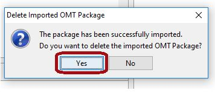

# Accessing the project

There are two ways you can access a project, depending on whether it's the first time or not: 

+ If you receive a new project package, you need to unpack it to create the project in OmegaT and access it for the first time.
+ After you have already unpacked a project, you can access it any time from the list of recent projects.

## Unpacking a new project

You must unpack a project (from the OMT package) to access it for the first time. 

To unpack a project, follow these steps: 

1. Download the **OMT package**.

2. Store the **OMT package** in the folder where you would like your OmegaT project folder to be created.<!-- @todo: tips on file organization -->

3. Unpack the project from the **OMT package**:
  
    + Launch OmegaT.
  
    + Go to **Project** > **Unpack project from OMT file**:<!-- @todo: update screenshot -->

        

        <!-- { align=right } -->

    + Navigate to the location where you stored the OMT package. Select the **OMT package** and click on Open:
  
        

    + A pop up opens. Click **Yes**.
  
         

4. You can now perform your task in the project.

When you are done working for the day, quit OmegaT (++ctrl+q++).

!!! caution
    Unpacking a project needs to be performed _only once_ for each OmegaT package. After you have unpacked the project, you can simply open it from the list of recent projects, as explaind below. If you unpack the OMT file again, you might overwrite your changes and lose your work.
    <!-- @todo: to be tested... -->

## Accessing an unpacked project

The next times you want to access the project in OmegaT, go to **Project** > **Open Recent Project**. The project you were working on will appear in the list:

   

!!! note
    Make sure the disctinction between "opening" a project and "unpacking" a project is clear for you. You open a project that already exists because you have already unpacked it, whereas you unpack a project that doesn't exist yet. Before you can open a new project, you must unpack it from the OMT file.