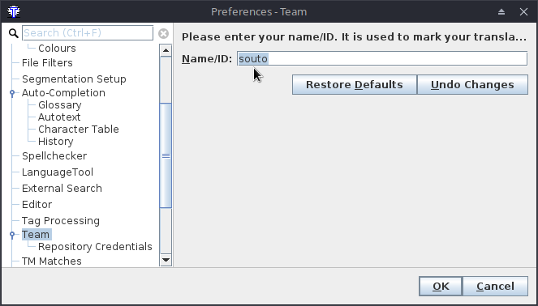

## Your user Name/ID

When opening OmegaT for the first time, please update your Name/ID. To do that click on **Options** > **Preferences** > **Team**. 

The Name/ID box might already contain your username. If that's the case, it's fine like that. Otherwise, if the box is empty or ther's some detail that doesn't identify you (e.g. USER), please enter your name or a nickname that identifies you more or less uniquely and that we can associate with you.

If you have been asked to use "VER" in a specific project, you can append your name or initials to that (e.g. `VER_msoutopico`, `VER_manuel`, etc). 

Then press OK.

