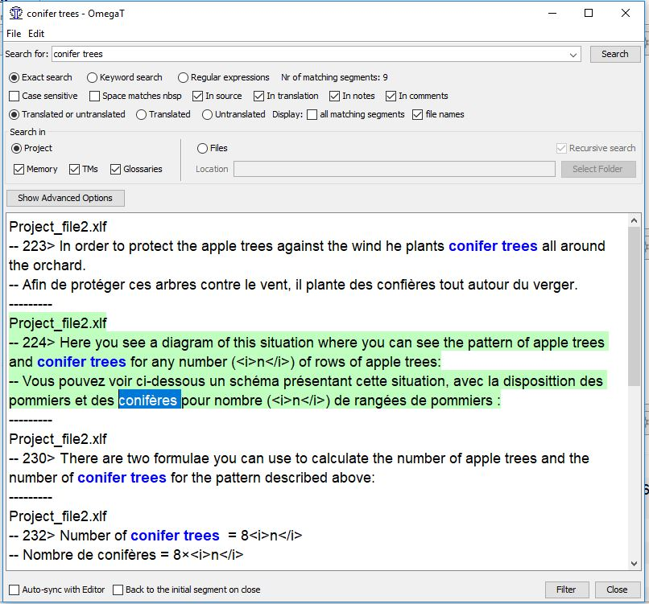

## Running concordance searches

A concordance search allows you to find words and expressions in the translation memory and the glossary. 

To perform a search follow the steps below:

  * In the active segment, select the word or fragment you want to search for with your mouse.
  * While that part of the text is selected, press ++ctrl+f++ on your keyboard. 
  * Press the **Search** button in the **Search** window that will open.

The list results will be displayed. You can copy (select with mouse and press ++ctrl+c++ on your keyboard) what you need from the results and paste it in the right place in the translation.

!!! note
    There might be small differences (in punctuation, spacing, etc.) between the text you're searching for and other occurrences of the same text that would prevent an *exact match*. The option "Keyword search" might help overcome that problem, please use it if you don't get the results you were expecting.