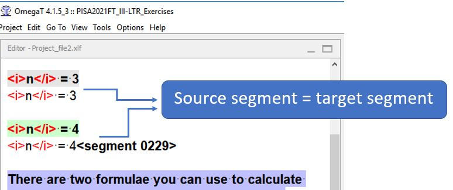

## Inserting source segment in target

In some cases, the translation must be identical to the source text. To copy the source text in the translation, press ++ctrl+shift+s++ on your keyboard.

<!-- @todo: update screenshot -->

Of course, you may also copy-paste the source text in the translation if you prefer.
