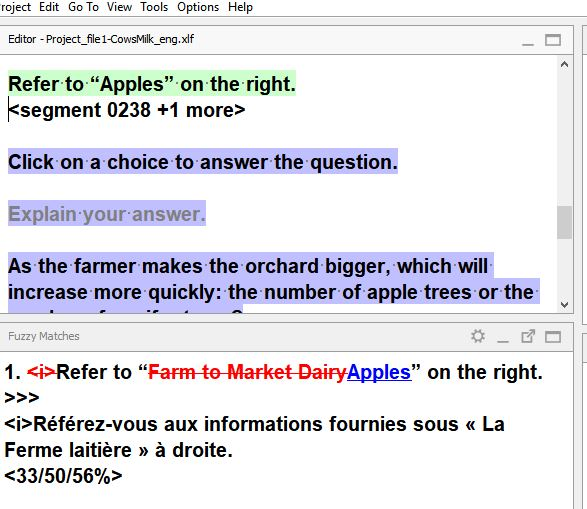
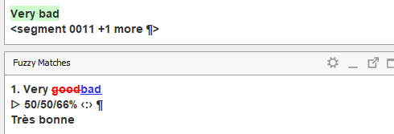
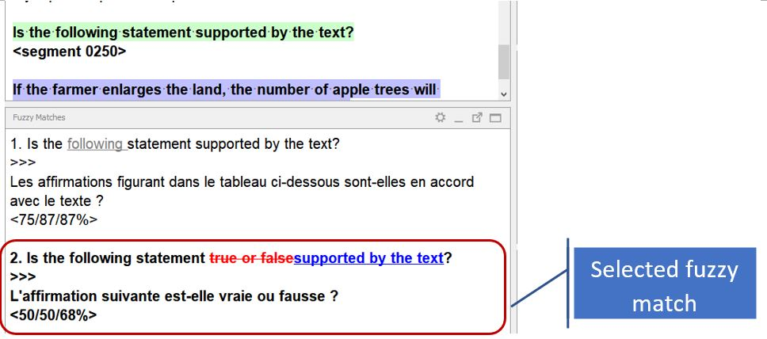
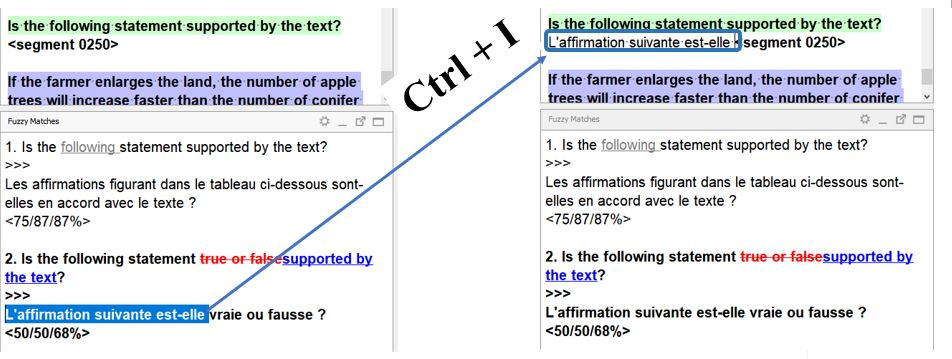

# Matches

Translations are saved in the working TM of the project. When you open a segment that is similar to one that has already been translated, you will see translation suggestions (or matches) appearing in the **Matches** pane. 

The source text in the **Matches** pane uses “track changes” mode to show the differences (e.g. {~~old~>new~~}) between the new source text in the active segment and the source text in the fuzzy match selected.

  * Parts that do not appear in the active segment are {~~struck through~>~~}
  * Parts that appear in the match are {~~~>underlined~~} <!-- ^^underlined^^ -->

    <!--  -->
    
    <!-- normalize text size in screenshots -->

Also, the **Matches** pane shows a similarity score that tells you how different the new source text is from the source text of every match. 
<!-- @todo: add screenshot that shows the score -->

When there are several matches for a segment, they are sorted by their similarity to the new segment. The active match is the one in **bold** (by default, the one at the top of the list). If you want to use a different match, **double click** on it to activate it. 

To insert the match in full, press ++ctrl+i++ on your keyboard. After inserting it, do not forget to make any necessary changes so that it fits the segment you are translating.

Alternatively, you can also insert only a part of the fuzzy match or combine several matches:

  * _Double-click_ the match you want to use to activate it
  * With your mouse, select the part you wish to insert
  * Press ++ctrl+i++ on your keyboard to insert it 

Do the same to insert (part of) other matches if appropriate or finish translating the segment.

<!-- @todo: gif needed, vertical, less space -->