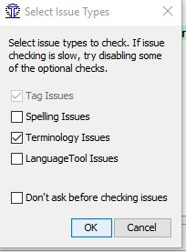
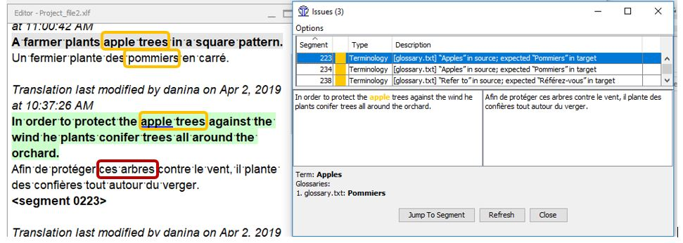

## Check glossary adherence

You can check whether the translation adheres to the glossary and key terms have been translated consistently throughout:

- Go to **Tools** > **Check Issues**
- Make sure the box next to **Terminology Issues** is ticked

  

- Press **OK**
- A list of potential errors will open:

  

- Go through the issues one by one. For every issue in the list, do the following:

  - Click a row in the list (or click on **Jump to Segment**) to open that segment in the editor.
  - Correct the error if necessary.
  - Press the **Refresh** button to update the list of issues.

!!! info
Not all flagged issues are errors by default. In some cases, you may get _false positives_. In the screenshot below, "apple trees" should be translated as "pommiers" as in the first segment. In the second segment (active segment) "apple trees" was rendered as "ces arbres" (backtranslation: these trees) to avoid a repetition that would be disturbing in French. Such deviations from the glossary are intentional, so you would disregard the issue.

    
