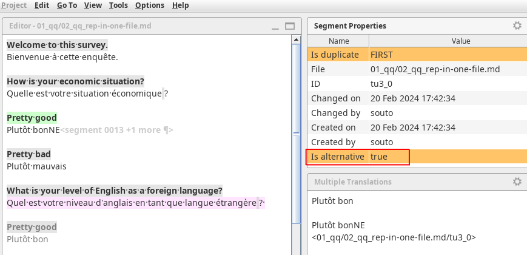
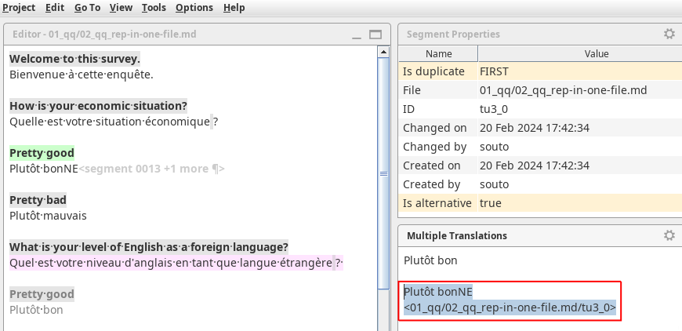
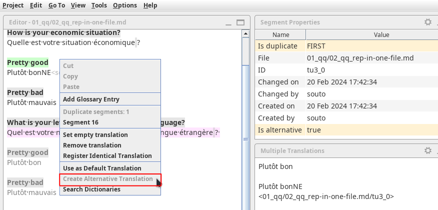

# Handling repetitions

Some segments may be **repeated** in the project. By default, the translation of a repeated segment is __autopropagated__ to all its instances.

## Identifying repeated segments

You can recognize that you are in a repeated segment because the **Segment Properties** pane will show a field called **Is duplicate** (with value `FIRST` for the first repetitions and value `NEXT` for any others).
<!-- @todo: in the navigation across panes add segment properties -->
<!-- @todo: update "navigation across panes" > "navigation through panes" -->

  
  <!--  -->
   
  <!-- @todo: harmonize font size across all screenshots and gifs -->

Also, the segment number also includes how many more repetitions the active segment has.

Also, repeated segments from the second instance onwards have grey font, which could help you realize they are instances of a repeated segment.
<!-- @todo: repetitions in black and gray font -->

If you **right click** on a repeated segment, the contextual menu will list all the other instances. It can be useful to jump to them (by clicking on one of them from the contextual menu) to see the different contexts in which that repeated segment appears in the project.

  

## Autopropagation

When you edit the translation of a repeated segment, as soon as the edit is saved the changes will be automatically reflected in all the repetitions in the project.

  

## Creating alternative translation

In some cases, two instances of a repeated segment might need to be translated differently in different contexts. In that situation, you may want to modify the translation of only one of the repetitions without altering the rest. 

In other words, you must create an **alternative translation** to prevent _auto-propagating_ your update. 

To create an **alternative translation**: 

  1. _Right click_ on the segment and choose **Create Alternative Translation** from the contextual menu.
    <!--  -->
  2. Edit the translation of the active segment.
  3. Press ++ctrl+s++ to register the alternative translation.
    <!--  -->
    <!-- @todo: use the example from the slides -->

The **Multiple Translations** pane will show the different translations.

And here's a quick summary: 

<!-- @todo for Danina: repeat video, Ctrl+S for every segment! -->

!!! danger
    Alternative translations may be treacherous if not applied correctly. Make sure you follow the three steps above precisely.

The following video shows how to create alternative translations, enjoy :octicons-heart-fill-24:{ .heart }:

<iframe src="https://player.vimeo.com/video/789832289?h=5fd29f998e" style="position:absolute;top:0;left:0;width:100%;height:100%;" frameborder="0" allow="autoplay; fullscreen; picture-in-picture" allowfullscreen></iframe>

!!! warning
    Remember that you can't create an alternative translation if the segment already has an alternative translation. See the section below to learn how you can recognize an alternative translation.

If you must modify an existing alternative translation, simply edit the target text and save (++ctrl+s++).

## Identifying alternative translations

Here's how you can recognize whether a segment has an alternative translation.

On the one hand, if a segment has an alternative translation, the **Segment properties** pane will show a property called **Is alternative** with value `true`. That field will flash in orange when you active the segment or when you save the project while that segment is active.

On the other hand, you will notice that the **Multiple translations** pane shows that translation and the context properties that the alternative translation binds too (typically the file name and some identifier, e.g. the segment ID or a key).

Finally, and most eloquent, you can see that the segment has an alternative translation if the **Create Alternative Translation** item in the segment's contextual menu (or the **Edit** menu) is grayed out and cannot be selected.

## Restoring the default translation

If for some reason an existing alternative translation is unnecessary and you would like to restore auto-propagation into that segment, the simplest way is to just delete the alternative translation. To do that, follow these simple steps: 

- Go to the segment where you want to restore the default translation
- Press ++ctrl+a++ on your keyboard to select the whole target text
- Press the ++del++ on your keyboard to delete the translation
- Press ++ctrl+s++ to save (or leave the segment) to restore the default translation