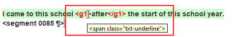

## What are tags

The source text might include some inline codes that stand for formatting or other elements. In OmegaT, those inline codes are handled as **tags**. 

For example, part of the source text could be, say, underlined (e.g. the word "after" below):

> I came to this school <u>after</u> the start of this school year.

The segment in OmegaT will look like this (notice the paired tags enclosing the word "after"):

> I came to this school **&lt;g1&gt;**{ .omttag }after**&lt;/g1&gt;**{ .omttag } the start of this school year.

You will recognize tags because they are in **red font**.

Hover over a tag if you want to see what it stands for. A tooltip will show the original inline code:

<!--  -->
> 

