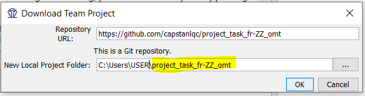
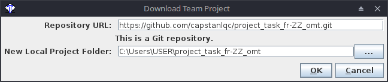
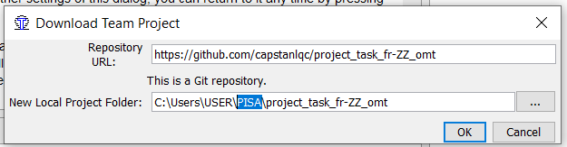
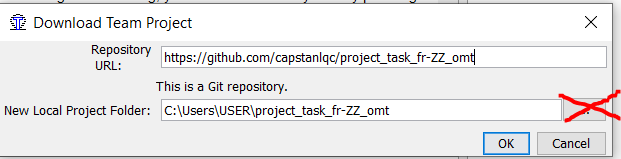

# 10. Working with team projects

Unlike in previous cycles, in this cycle you will work on an online team project hosted in a git repository. 

## Download team project from git repository

??? Abstract "The relevant section in the guides..." 
    See the relevant section in your guide:

    [Translation](../../translation/accessing-the-project/#downloading-a-team-project){:target="_blank" .md-button }
    [Reconciliation](../../reconciliation/accessing-the-project/#downloading-a-team-project){:target="_blank" .md-button }
    [Adaptation](../../adaptation/accessing-the-project/#downloading-a-team-project){:target="_blank" .md-button }
    [Verification](../../verification/accessing-the-project/#downloading-a-team-project){:target="_blank" .md-button }


### Details

Here are the details of a team project you can download for training purposes. 

!!! warning
	This is not the project where you must work to produce your translation.

URL of the git repository:
```url
https://github.com/capstanlqc/project_task_fr-ZZ_omt.git
``` 

Username:
```username
pisa25npm
``` 

Password:

> [password](http://cat.capstan.be/OmegaT/exercises/password.txt){:target="_blank"}

(For security reasons, the password is provided in a separate page. Just click on the link above to open it.)

### Steps

1. In OmegaT, go to **Project** > **Download Team Project**.

2. Paste the URL of the git repository in the "Repository URL" field.

3. Then click on the "New Local Project Folder" field.

	> OmegaT will propose a location to clone the project in your machine, e.g. something like `C:\Users\USER\project_task_fr-ZZ_omt` (where `USER` is your username).

The name of the project is highlighted in yellow in the screenshot below: 


<!--  -->

If the proposed path to the local project folder is fine, just press **OK**. All files in the project will be downloaded and the project will be open in OmegaT after a few seconds.

??? note "Want to edit the local project folder?"
	You may change or edit the path to the location where the project will be created, e.g. to create the project in a `PISA` folder:

	

	In any case, do not change the name of the project (highlighted in yellow below):

	

	Please check our [File organization](../misc/tips/#file-organization) tips, they could help you keep your files and folders more organized.


!!! warning
	The location where you create the team project should not be inside a folder sync'ed by Dropbox, OneDrive, Nextcloud, etc. (any sync'ing service in your machine).

<!--  -->

<!--


-->

## Commit target files

??? Abstract "The relevant section in the guides..." 
    See the relevant section in your guide:

    [Translation](../../translation/creating-your-deliverable/#online-team-project-via-repository){:target="_blank" .md-button }
    [Reconciliation](../../reconciliation/creating-your-deliverable/#online-team-project-via-repository){:target="_blank" .md-button }
    [Adaptation](../../adaptation/creating-your-deliverable/#online-team-project-via-repository){:target="_blank" .md-button }
    [Verification](../../verification/creating-your-deliverable/#online-team-project-via-repository){:target="_blank" .md-button }


To commit target files (e.g. to update the preview):

   * Go to **Project** > **Commit Target Files**.
