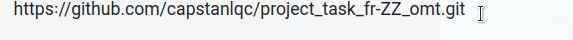

# Tips and tricks

## File organization

File organization on your end is very important for the successful execution of your work. Here come some recommendations for a tidy organization.

1. Designate a working folder for the project in your machine, and use that same location for all related tasks. We would suggest a location at a very high level in the folder structure in your computer, e.g.

    - On Windows: `C:\Work\CLIENT\PROJECT` or `C:\Users\USER\Work\CLIENT\PROJECT`
    - On Mac/Linux: `/Users/USER/Work/CLIENT/PROJECT`

2. Inside the `PROJECT`'s working folder above, create the following folder structure (or something similar that fits your purposes):

```
    ├── 00_Admin
    ├── 01_Instructions
    ├── 02_Tasks
    └── 03_Whatever
```

Create your OmegaT project folders inside, say, `C:\Users\Manolo\Work\cApStAn\Globex\02_Tasks`. The final path to the OmegaT project folder should look like `C:\Users\USER\Work\CLIENT\PROJECT\02_Tasks\OMT-PROJ-DIR`, where `OMT-PROJ-DIR` is (the name of) your local OmegaT project folder.

## How to copy-paste a URL

1. Select the URL:

    - To select the URL, click right before the first character of the URL and drag your mouse up to the end of the URL.

2. Copy the URL:

    - When the whole URL is highlighted (which means that it's selected), press ++ctrl+c++ in your keyboard.

    - Alternatively, you may right-click the highlighted text and select **Copy** in the contextual menu that will appear. <!-- @todo: gif -->
     

    - When you copy text, it'll be stored in your clipboard.

3. Paste the URL:

    - Go to the location where you want to paste the URL and press ++ctrl+v++ to insert it there.
