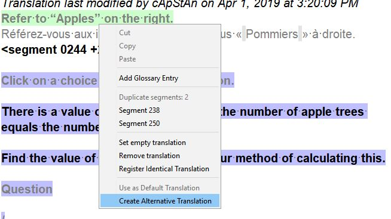

# Create alternative translation 

In some cases, you may not wish to modify the translation of repeated segments. If you want your edits to be autopropagated, nothing special needs to be done: just edit one segment in a group of repetitions and save. If however, due to a different context, you may need to change the translation of only ONE of the repeated segments:

  * **Right click** on the segment 
  * Choose **Create Alternative Translation** from the contextual menu
    

  * Change the translation of your active segment and then either press ++ctrl+s++ or move to the next one.

  

If you return on the repeated segment, you will see the different translations appear in the Multiple Translations pane.
