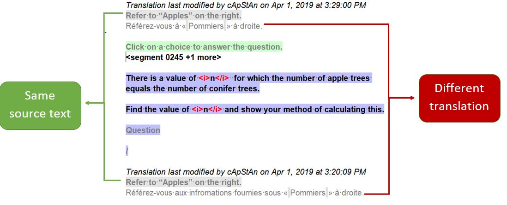

# Создание альтернативного перевода

В некоторых случаях может возникнуть необходимость перевести сегмент, не меняя при этом перевод во всех повторяемых сегментах. Если вы хотите, чтобы ваши изменения были автоматически скопированы во всех повторах, то никаких дополнительных действий не требуется. Достаточно отредактировать любой сегмент, имеющий повторы, и сохранить проект. Если же, исходя из контекста, вам нужно изменить перевод только ОДНОГО из повторяемых сегментов, сделайте следующее:

- **Щелкните правой кнопкой** мыши на сегменте.
- Выберите пункт контекстного меню **Create Alternative Translation** (Создать вариант перевода).
   

- Измените перевод активного сегмента, а затем либо нажмите ++ctrl+s++, либо перейдите к следующему сегменту.

Если вы вернетесь к повторному сегменту, то увидите, что различные переводы отображаются на панели Multiple Translations (Варианты перевода).
