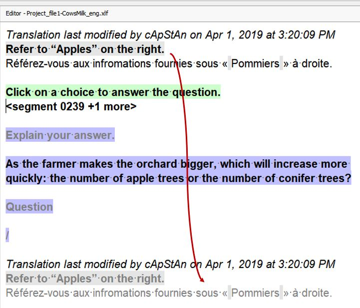

Если вы редактируете перевод повторяющегося сегмента, по умолчанию изменения будут автоматически отражены во всех повторах. Повторяющийся сегмент — это сегмент, имеющий идентичный текст оригинала либо в текущем файле, либо в любом другом файле в проекте OmegaT.

