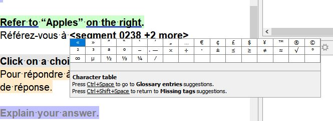
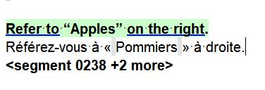
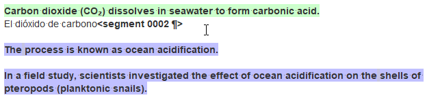
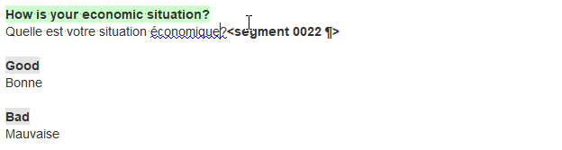

## Вставка специальных символов

Вам может потребоваться ввести специальные символы, например:

- кавычки: `«»`, `„“`, `‘’` и т. д.
- математические символы: `×`, `π`, `÷`, `≤`, `≠`, `√` и т. д.
- надстрочные или подстрочные цифры или буквы: `₂`, `²`, `³` и т. д.
- другие символы: `®`, `™`, и т. д.

### Таблица символов

Мы поместили наиболее часто используемые символы в таблицу символов (**Character Table**). Для вставки специального символа из таблицы символов (**Character Table**) выполните следующие действия:

- Нажмите на клавиатуре ++ctrl+пробел++ несколько раз, пока не появится блок **Character Table** (Таблица символов).
   
- Дважды щелкните по символу, который требуется вставить.
   <!--  -->

### Автотекст

Кроме того, можно использовать записи **автотекста** для вставки специальных символов, вводя установленные сокращения. Список доступных сокращений приводится [здесь](../misc/autotext.md){:target="\_blank"}.

Рассмотрим несколько примеров:

- Например, чтобы ввести обозначение квадратных метров («м²»), можно ввести сокращение `\sup2`, которое даст возможность вставить надстрочную двойку — `²`.

- Еще один пример. В химических формулах количество атомов часто обозначается подстрочным числом, например «CO₂». Чтобы вставить символ `₂`, введите сокращение `\sub2`.
   
   <!-- @ŧodo: @exercise: type CO₂ using autotext -->

- Чтобы вставить неразрывный пробел, введите `\nbsp`. Модуль автозавершения предложит вставить соответствующий символ из списка автотекста.
   
