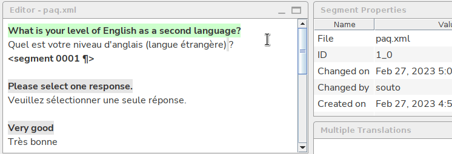
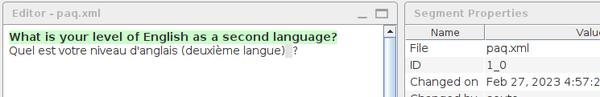

# Revising and editing

## Revising the translation

To revise the translation, you must move through segments one by one.

Read every translation, while comparing with the source text, considering the rest of the context and taking into account any specific instructions you may have received for your particular task.

Press the ++enter++ key to move to the next segment. The segment you jump to becomes **active**{ .active } and ready for edits. This will also allow you to keep track of your progress.

If you need to move backwards, you can press ++ctrl+enter++.

<!-- @todo: RFF: ask Kos to add option to filter: segments with translation from x-auto or x-enforce or both, or segments that do not have a translation coming from x-auto, or that do not have a translation coming from x-enforce, or both

segments with translations from
☑️ /tm/auto
☑️ /tm/enforce

-->

## Editing the translation

To correct an error in the translation, you must edit the target text. To edit a translation, simply delete the text that must be removed and type the text that must be added.

You can only edit the translation of the **active**{ .active } segment. You must activate a segment to make it editable. The segment you jump to pressing ++enter++ becomes **active**{ .active } and ready for edits.

You may also activate any segment (and make it editable) by double-clicking it, but in that case you might want to return to the segment you were originally to continue revising from there.

!!! tip
    You can recognize the **active**{ .active } segment because it is highlighted in **green**{ .active }.
