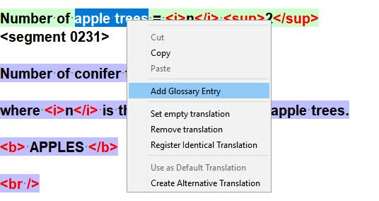
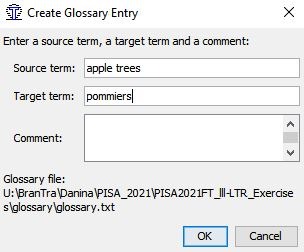

## Adding new entries to the glossary

!!! tip
    Feeding the glossary with technical or sensitive wording or terms or expressions that appear frequently can be very useful to speed up typing, to keep consistency, to avoid typos, etc..

To add a new term entry to the glossary:

1. In the active segment, drag your mouse over the term you want to insert **to select it**.
2. **Right click** and choose **Add glossary entry** from the contextual menu.

   

3. In the **Create Glossary Entry** that will pop up, enter the target term (and any comments you want).

   

4. Press the **OK** button to save the new entry.
