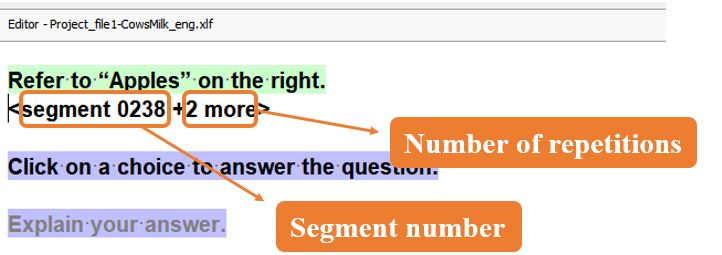

Повторяемый сегмент можно отличить от других по использованному в нем серому цвету шрифта.
При активации повторяемого сегмента в блоке, показывающем номер сегмента, будет указано, сколько повторений имеет данный сегмент.

Если **щелкнуть правой кнопкой мыши** на повторяющемся сегменте, в контекстном меню будут указано, какие сегменты являются повторами текущего сегмента. Иногда бывает полезно перейти к ним (выбрав нужный номер из контекстного меню), чтобы увидеть различные контексты, в которых используется повторяющийся сегмент.

<!-- @todo: get list of all included files in guides, then find the ones that are not included -->
