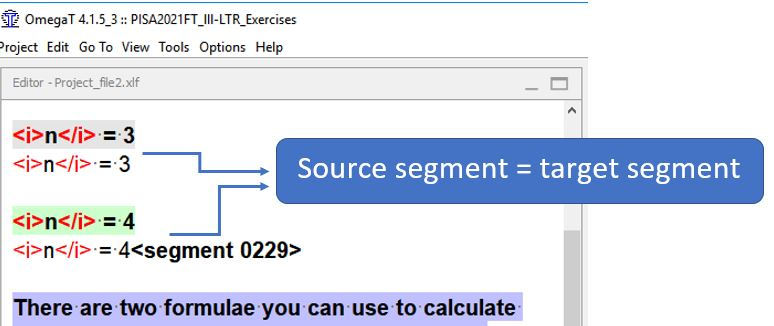

## Вставка текста оригинала в перевод

В некоторых случаях перевод должен быть идентичен исходному тексту. Чтобы скопировать оригинальный текст в перевод, нажмите сочетание клавиш ++ctrl+shift+s++.

<!-- @todo: update screenshot -->

Конечно, при желании исходный текст можно копировать и вставлять в перевод.
