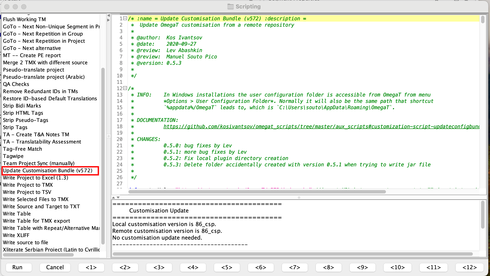

# Руководство по установке OmegaT 5.7.2 для macOS

Вам следует ==тщательно выбрать правильный вариант==, исходя из своих начальных условий:

- Если у вас уже установлена предыдущая версия OmegaT (например, 5.7.1 или 4.2.0), вам следует сначала обновить конфигурацию программы. Как это сделать, описано в [разделе о конфигурации](#configuration) (следующий раздел).
- Если в настоящий момент на вашем компьютере OmegaT не установлена, вам нужно вначале установить программу, как описано в [разделе об установке](#installation). После установки вам понадобится скачать и запустить скрипт конфигурации, как описано в пунктах 2 и 3 [раздела о конфигурации](#configuration) (следующий раздел).

## Конфигурация

Этот раздел предназначен для пользователей, на компьютере которых уже установленна предыдущая версия OmegaT (например, 5.7.1 или 4.2.0). Для обновления конфигурации программы выполните шаги, приведенные ниже.

1. Run OmegaT and go to **Tools** > **Scripting** to open your scripting console, In OmegaT 5.7.1, please open the scripting console. Проверьте, есть ли у вас скрипт под названием **Update Customisation Bundle (v572)**:

   !!! Предупреждение
       Если в названии нет фрагмента **v572**, то это не тот скрипт, который нам нужен. В следующем шаге описано, где взять этот скрипт.

   

   Если скрипт **Update Customisation Bundle (v572)** есть в списке, выберете его щелчком мыши и нажмите кнопку **Run** (Выполнить) в левом нижнем углу окна для запуска скрипта. Скрипт выполнит обновление файлов конфигурации и завершит работу OmegaT. Далее пропустите следующий шаг и перейдите непосредственно к [разделу установки](#installation).

   Если скрипт отсутствует в списке, вы можете скачать его самостоятельно. В дальнейших шагах описано, как это сделать.

2. Нажмите правой кнопкой мыши на кнопку ниже и выберите «Сохранить как», чтобы загрузить скрипт конфигурации (например, на рабочий стол)7

   [:material-download: Скачать UpdateConfigBundle.groovy](https://cat.capstan.be/OmegaT/v572/customization/scripts/updateConfigBundle.groovy){ .md-button .md-button--primary }

3. В главном окне OmegaT выполните следующие действия для запуска скаченного скрипта конфигурации:

   - **Tools** (Инструменты) > **Scripting** (Скрипты) > **File** (Файл) > **Open script** (Открыть скрипт).
   - Перейдите на рабочий стол (или в папку, в которой был сохранен скрипт) и выберите файл с расширением groovy.
   - Нажмите кнопку **Open** (Открыть), чтобы открыть файл скрипта, далее нажмите кнопку **Run** (Выполнить)в левом нижнем углу окна.

   

   Скрипт установит необходимые файлы конфигурации для OmegaT 5.7.2 и удалит старые файлы для предыдущих версий, после чего завершит работу программы.

4. Удалите текущую версию OmegaT.

   Для этого просто переместите установленное приложение **OmegaT.app** в Корзину.

5. После этого переходите к [разделу установки](#installation) (следующий шаг).

## Установка

1. Нажмите на кнопку ниже, чтобы загрузить OmegaT 5.7.2. Это специальная версия, подготовленная компанией cApStAn. Она включает в себя несколько исправлений ошибок и улучшений, недоступных в других версиях.

   [:material-download: Загрузить OmegaT 5.7.2](https://cat.capstan.be/OmegaT/exe/OmegaT_5.7.2_Mac.zip){ .md-button .md-button--primary }

2. Если вы используете Safari, то по окончании загрузки файл будет распакован автоматически. Если вы используете другой браузер, то для распаковки файла вам нужно дважды щелкнуть на нем по окончании загрузки.

3. Скачанный файл будет распакован в новую папку — откройте ее, чтобы просмотреть содержимое. Внутри вы увидите файл **OmegaT.app**.

4. Перетащите файл **OmegaT.app** в папку **Applications** (Приложения).

    
<video playsinline="" controls="controls" poster="https://s3.amazonaws.com/media-p.slid.es/videos/1129410/Sjlk4rKG/1kx16dhvq0_thumb_00001.jpg" data-paused-by-reveal="" data-lazy-loaded="" src="https://s3.amazonaws.com/media-p.slid.es/videos/1129410/Sjlk4rKG/1kx16dhvq0.mp4"></video>

5. Теперь OmegaT установлена. Перейдите в папку **Applications** (Приложения) и откройте находящееся там приложение **OmegaT.app**.
6. macOS может запросить подтверждение того, что вы действительно хотите запустить приложение. Если это произойдет, нажмите **Open** (Открыть). Далее запустится OmegaT.

    
<video playsinline="" controls="controls" poster="https://s3.amazonaws.com/media-p.slid.es/videos/1129410/eXYV2O_T/oiepooibjr_thumb_00001.jpg" data-lazy-loaded="" data-paused-by-reveal="" src="https://s3.amazonaws.com/media-p.slid.es/videos/1129410/eXYV2O_T/oiepooibjr.mp4"></video>

7. Если вы хотите выполнить проверку после установки, чтобы убедиться, действительно ли у вас установлена правильная версия, вы можете проверить это в меню **Help** (Справка) > **About** (О программе) > **Copy Support Info** (Копировать информацию для поддержки). Вы должны увидеть:

   > Version: OmegaT-5.7.2_0_a978d82ee  
   > Platform: [ваша операционная система]  
   > Java: 11.0.19 amd64

Все готово. Можно приступать к использованию OmegaT 5.7.2.

<!--
To install OmegaT and set it up on a computer running Windows, please follow the OmegaT installation and setup guide below:

<iframe
src="https://slides.com/capstan/omegat-v572-setup-guide/embed?byline=hidden&share=hidden"
width="100%"
height="420"
scrolling="no"
frameborder="0"
webkitallowfullscreen mozallowfullscreen allowfullscreen>
</iframe>

If you use Mac or Linux, please see the second slide above or get in touch through the Helpdesk.

- USB
16GBc
model...
format as FAT32
D:\OmegaT
zip -- iso

https://www.westerndigital.com/products/usb-flash-drives/sandisk-ultra-fit-usb-3-1?sku=SDCZ430-016G-G46

-->
