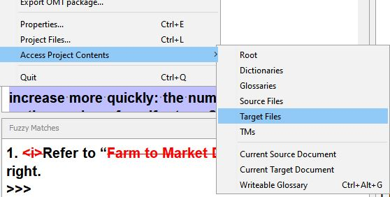

# Creating target files

A target file (or translated document) has the same structure as the source file but contains the target text (your translation).

If you need to use the target file directly, you must create it every time you update the translation in the editor.

Press ++ctrl+shift+d++ (or go to **Project** > **Create Current Translated Document**) to create the target file you were working on.

To access the file(s), go to **Project** > **Access Project Contents** > **Target Files** to open your file explorer in the `/target` folder of the project. The file you were working on should be there.

<!-- @todo: update screenshot with standard font size -->

<!-- prettier-ignore -->
!!! info
    The target file will be overwritten every time you press ++ctrl+shift+d++
