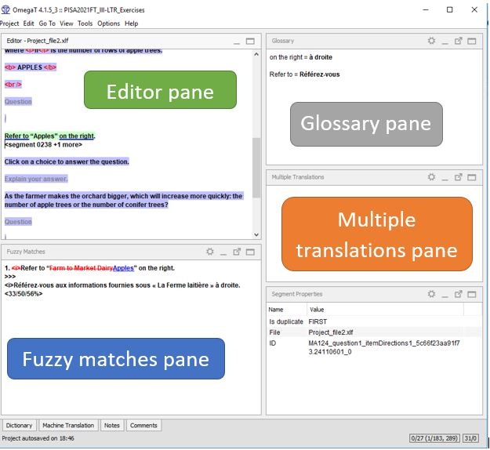

## Навигация между областями программы

Открыв OmegaT, вы заметите, что главный экран разделен на несколько областей:

- **Editor** (Область редактирования) — это основная область, в которой вы будете работать.
- Перевод похожих сегментов будет отображаться в области **Fuzzy Matches** (Нечеткие совпадения) (в более поздних версиях эта область называется **Matches** в английском интерфейсе программы).
- В области **Glossary** (Глоссарий) будут отображаться ранее добавленные и ваши собственные записи глоссария.
- В области **Multiple Translations** (Варианты перевода) будет появляться текст, если текущий сегмент имеет альтернативные переводы.

