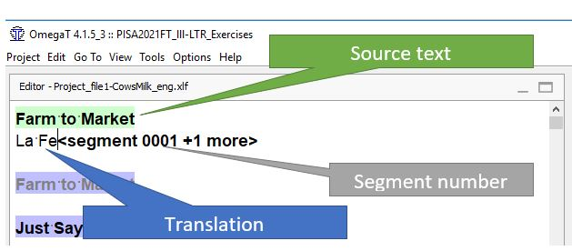
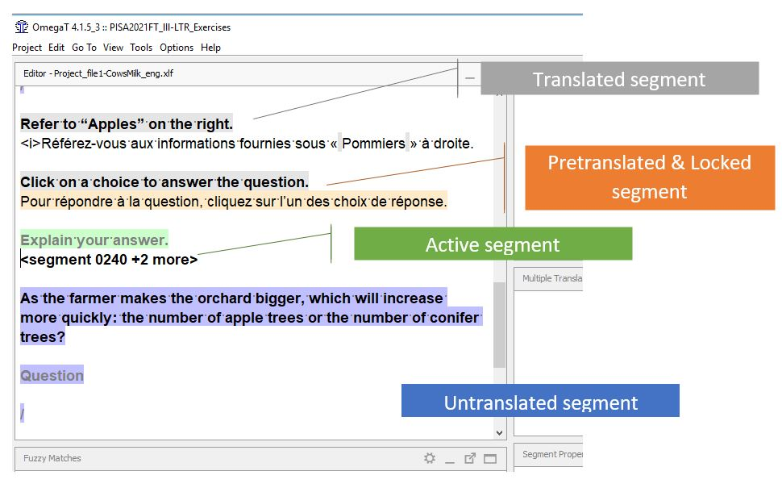

## Навигация по сегментам

В области редактирования активный сегмент выделен зеленым цветом. Это тот сегмент, над которым вы сейчас работаете. Когда вы вводите или вставляете перевод, он будет добавляться прямо **под исходным текстом**.

Нажмите ++enter++ на клавиатуре, чтобы перейти к следующему сегменту. Кроме того, можно использовать ++ctrl+u++ для перехода к следующему непереведенному сегменту.
Сегмент можно также активировать двойным щелчком — после этого он становится зеленым.

В OmegaT **цвет** фона сегмента помогает ориентироваться между различными сегментами:

| Цвет | Язык | Значение |
| ------------------------- | -------- | ----------------------------------------------- |
| **Зеленый**{ .active } | Оригинал | активный сегмент (сегмент, над которым вы работаете) |
| **Синий**{ .untranslated } | Оригинал | непереведенный сегмент |
| **Серый**{ .translated } | Оригинал | сегмент переведен вручную |
| **Розовый**{ .auto } | Перевод | сегмент переведен автоматически из памяти переводов |
| **Оранжевый**{ .enforce } | Перевод | предварительно переведенный и заблокированный сегмент (например, тренд) |

<!-- @todo: add pink pretranslate -->

<!-- prettier-ignore -->
!!! Предупреждение
    Если вы хотите изменить заблокированный сегмент, задокументируйте желаемое изменение в форме для мониторинга, но не пытайтесь изменить перевод в OmegaT. Любые изменения, внесенные в такие сегменты, не сохранятся. Существующий перевод останется в текущем виде.

В следующем видео показана навигация по сегментам. Приятного просмотра :octicons-heart-fill-24:{ .heart }.

<iframe src="https://player.vimeo.com/video/780443426?h=f715fb64e6" style="position:absolute;top:0;left:0;width:100%;height:100%;" frameborder="0" allow="autoplay; fullscreen; picture-in-picture" allowfullscreen></iframe>

