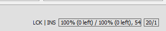

## Completion check

All segments in the project must have a translation. To confirm that is the case, please check for completion before your delivery.

To check completion, hover with your mouse pointer over the progress status bar, in the bottom right corner of OmegaT's main window.

<!-- @todo: red square around the figures -->

That bar shows some statistics:

* unique translated (unique left) per file (e.g. `100% (0 left)` as above)
+ unique translated (unique left) per project (e.g. `100% (0 left)` as above)
+ total number of segments (e.g. `54` as above)
<!-- @todo: screenshot with labels showing what is what -->

If you see something like `100% (0 left) / 100% (0 left), 54`, that means that all 54 segments in the project are translated. If you see a number higher that zero segments left, the translation is not complete.

If you have left some segment(s) untranslated, proceed as follows to fix that:

1. Press ++escape++ to close the **Project Files** window.
2. Press ++ctrl+u++ on your keyboard to jump to the __Next Untranslated Segment__.
3. Translate the segment

Repeat the steps above until no untranslated segments remain.

Finally, check the progress status bar again to confirm completion.