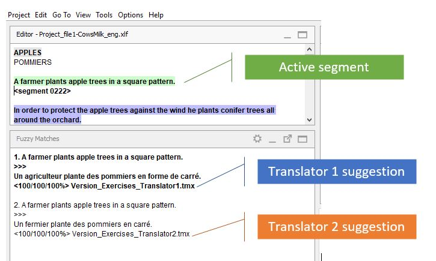
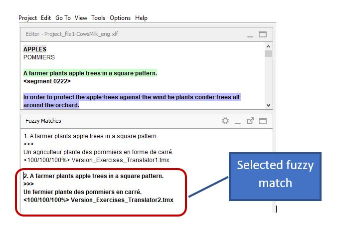

# Reconciling using matches

During the reconciliation task, the translations from **translator 1** and **translator 2** are handled as matches and are displayed in the **Matches** pane.

A reconciler's task in practice consists of one of these three options:

- Inserting one of the two matches (and then modify it if needed), **_OR_**
- Inserting part of one of the two matches and then inserting part of the other match, **_OR_**
- Translating the segment from scratch if none of the two matches is suitable.

By default, the match from translator 1 is activated. It is the first one in the list and it is **bolded**. If you want to use the match from translator 2, _double click_ on it to activate that one instead (the activated match will become **bolded**).

<!-- @todo: gif -->

To insert the active match in full, press ++ctrl+i++ on your keyboard. After inserting it, make any necessary changes so that it fits the segment you are reconciling.

Alternatively, you can also insert only part of a match or combine several matches:

- Double-click the match you want to use to activate it
- Drag your mouse over the part of the match you wish to insert to select it
- Press ++ctrl+i++ on your keyboard to insert it
- Select (part of) another match if appropriate or type the rest of the translation

<!-- @todo: gif -->

!!! tip "Remember"
It is important to make sure the final translation is **harmonized** as the two translators may use different terms and styles. To ensure this, make sure you preview the item prior to delivery and perform concordance searches on recurring instructions and terminology.
