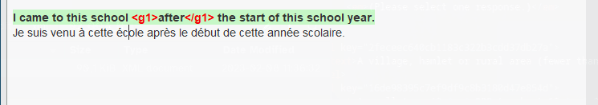
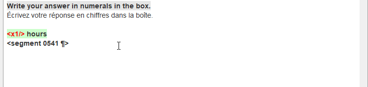

## Вставка тегов

Before inserting tags you must know whether it is a standalone tag or two paired tags.

<!-- ### Paired tags -->

To insert **paired tags** in your translation, proceed as follows:

1. Translate the segment.
2. Select the part of the translation that corresponds to the formatted part in the source text.
3. Press ++ctrl+space++ to launch the auto-completer.
4. In the tags section of the auto-completer, select the paired tags you want to insert.

!!! info
    The auto-completer has several sections, so if you don't see the tags section straight-away, just press ++ctrl+space++ again to cycle through the auto-completer until you see it.

<!-- ### Standalone tags -->

To insert a **standalone tag**, proceed as follows:

1. Click on the position where you want to insert the tag (before, after or while translating).
2. Press ++ctrl+space++ to launch the auto-completer.
3. In the tags section of the auto-completer, select the standalone tag you want to insert.

You can also insert a tag one by one with shortcut ++ctrl+t++.
