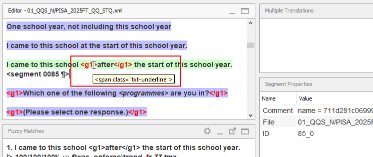
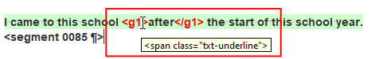

## Что такое теги

Исходный текст может включать встроенные коды, которые соответствуют форматированию или другим элементам в документе оригинала. В OmegaT эти встроенные коды обрабатываются как **теги**.

Например, часть исходного текста может быть, например, подчеркнута (например, слово «после» ниже):

> Я пришел в эту школу <u>после</u> начала этого учебного года.

Сегмент в OmegaT будет выглядеть следующим образом (обратите внимание на парные теги вокруг слова «после»):

> Я пришел в эту школу **<g1>**{ .omttag }после**</g1>**{ .omttag } начала этого учебного года.

Теги легко узнать по выделению **красным шрифтом**.

Наведите курсор на тег, чтобы узнать, что он обозначает. Во всплывающей подсказке будет показан исходный встроенный код:

<!--  -->

> 
