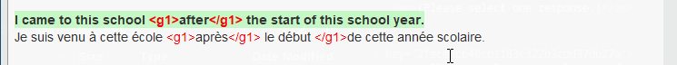
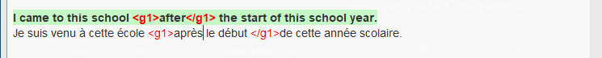
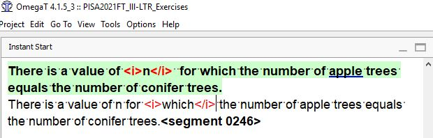
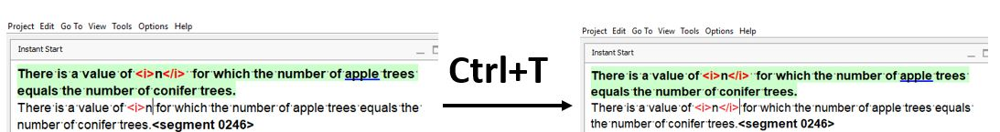

## Исправление проблем с тегами

Все теги, которые вы видите в исходном тексте, должны присутствовать и в переводе, причем в соответствующих местах. Если это не так, вам необходимо исправить все ошибки, которые будут обнаружены.

Такие ошибки могут быть двух типов:

- Отсутствует тег или пара тегов. В этом случае нужно просто [вставить теги](#inserting-tags).

- Тег вставлен, но расположен неправильно. Решение может заключаться либо в [перетаскивании](#moving-tags) отдельных тегов в нужное место, либо в [удалении тега](#deleting-tags) (или пары тегов) и повторной правильной [вставке](#inserting-tags).

<!-- prettier-ignore -->
??? warning "Предупреждение для языков с письмом справа налево"
    В языках с письмом справа налево (например, в арабском или иврите) перетаскивание тегов не сработает. Удалите тег и вставьте его заново в нужном месте, если вы работаете с одним из таких языков.

### Удаление тегов

Если вы вставили тег неправильно и вам нужно [вставить его](#inserting-tags) снова, **дважды щелкните** по тегу, чтобы выделить его полностью, и удалите его, нажав на клавиатуре клавишу ++backspace++ или ++delete++.

### Перемещение тегов

Если вы вставили тег в неправильном месте и вам нужно вставить его в другое место, то тег можно просто **перетащить мышью**. Можно также удалить его и вставить заново.

<!-- @todo: explain the auto-completer as the main insertion method -->

<!-- @todo: FINISH -->

<!--
In the screenshot below, in the source segment the **paired tags** **&lt;i&gt;**{ .omttag } and **&lt;/i&gt;**{ .omttag } are around the letter `n` while in the target they are around the word `which`.

To correct this issue, you would have to perform the following steps:

  1. Double click on the each incorrectly inserted tag in the translation to select it and press ++backspace++ or ++del++ on your keyboard to delete it
  2. Select the text that must encompassed by the paired tags.
  3. Press ++ctrl+space++ to launch the auto-completer. You might need to press ++ctrl+space++ several times to cycle through the different options until you see the list of tags.
  4. Select the paired tags that you want to insert and press ++enter++.
  <!-- 

The tags are inserted around the text you have selected.
-->
