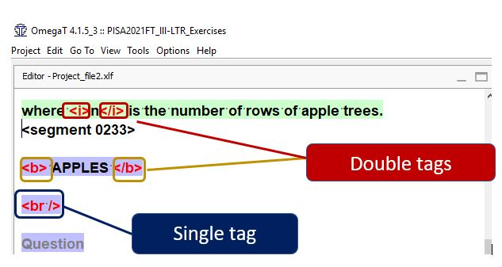
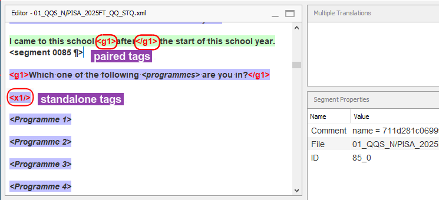

## Типы тегов

Существует два типа тегов: отдельные теги и парные или двойные теги.

- **Отдельный тег**: один тег (например. **<x1/>**{ .omttag }), который обозначает тот или иной элемент, появляющийся в исходном документе в данной позиции: перенос строки, изображение, поле ввода и т. д.

   

- **Парные теги** состоят из открывающего и закрывающего тегов (например, **<g2>**{ .omttag } и **</g2>**{ .omttag }) и применяются к тексту между ними. Парные теги можно определить по тому, что в них использовано одинаковое число.

   

   <!--  -->
   <!--  -->
   <!-- @todo: png, use example of same text in source and corresponding translation with tags aruond the same -->

Если исходный текст содержит **парные теги** вокруг слова или выражения, необходимо вставить такие же парные теги вокруг соответствующего слова или выражения в переводе.

В приведенном ниже примере парные теги представляют собой форматирование, применяемое к слову «после» и его переводу «après».

> Я пришел в эту школу **<g1>**{ .omttag }после**</g1>**{ .omttag } начала этого учебного года.
> Je suis venu à cette école **<g1>**{ .omttag }après**</g1>**{ .omttag } le début de cette année scolaire.

Если исходный текст содержит один или несколько **отдельных тегов**, их необходимо вставить в перевод в положении, эквивалентном их положению в оригинале.

<!--
>> Write your answer in numerals in the box. 
> Écrivez votre réponse en chiffres dans la boîte.
-->

В следующем примере отдельный тег представляет собой поле для ввода текста, в котором респондент должен выбрать число:

> <b>**<x1/>**{ .omttag } hours</b>  > **<x1/>**{ .omttag } heures
