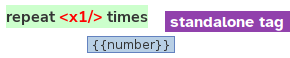
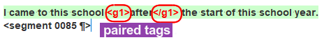

## Types of tags

There are two types of tags: standalone tags and paired tags or double tags:

- **Standalone tags**: a single tag (e.g. **&lt;x1/&gt;**{ .omttag }) which stands for some element that appears at that position, such as a line break, an image, an input field, etc.

  

- **Paired tags** are composed of an opening tag and a closing tag (e.g. **&lt;g2&gt;**{ .omttag } and **&lt;/g2&gt;**{ .omttag }) and affect the text between them. You can see that two tags are paired when they have the same number.

  

  <!--  -->
  <!--  -->
  <!-- @todo: png, use example of same text in source and corresponding translation with tags aruond the same -->

When the source text contains **paired tags** around a word or expression, you must insert the same paired tags around the part of the translation that corresponds to the formatted word or expression in the source text.

For example, here the paired tags represent some formatting that applies to the word "after" and its translation "après".

> <b>I came to this school **&lt;g1&gt;**{ .omttag }after**&lt;/g1&gt;**{ .omttag } the start of this school year.</b> 
> Je suis venu à cette école **&lt;g1&gt;**{ .omttag }après**&lt;/g1&gt;**{ .omttag } le début de cette année scolaire.

When the source text contains one or more **standalone tags**, you must insert them in the translation in a position that is equivalent to their position in the source text.

<!--
>> Write your answer in numerals in the box. 
> Écrivez votre réponse en chiffres dans la boîte.
-->

In the following example, the standalone tag represents a text entry field where the respondent will have to select a number:

> <b>**&lt;x1/&gt;**{ .omttag } hours</b>  > **&lt;x1/&gt;**{ .omttag } heures
