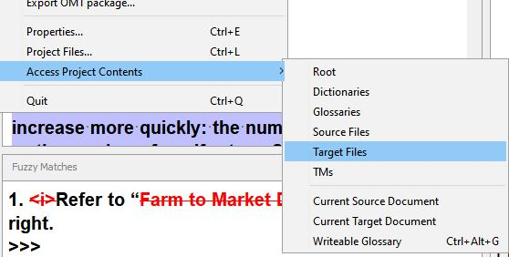

# Создание переведенных файлов

Нажмите ++ctrl+shift+d++, чтобы создать переведенный файл текущего документа, над которым вы работали. Таким образом вы можете просмотреть свои изменения, внесенные в файл.

Для получения доступа к файлу перейдите в меню **Project** (Проект) > **Access Project Contents** (Открыть содержимое проекта) > **Target Files** (Переведенные файлы). Откроется окно, в котором будет показано содержимое папки «target». Найдите файл, над которым вы работали (если в папке несколько файлов) и откройте его в соответствующем приложении, чтобы просмотреть перевод в контексте.

