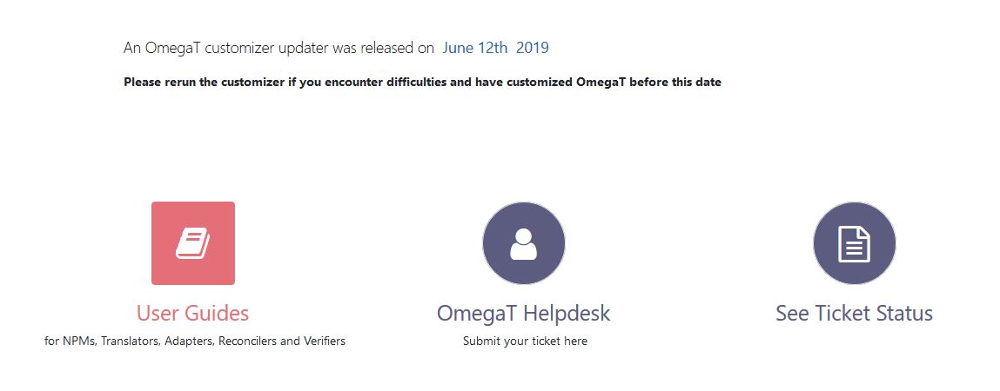
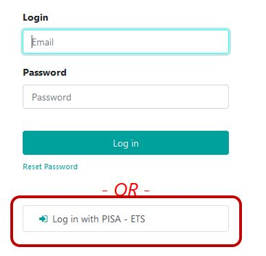
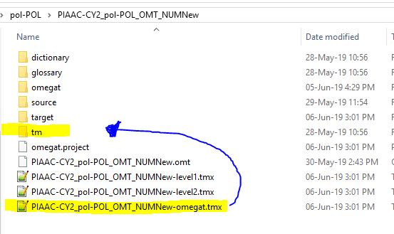
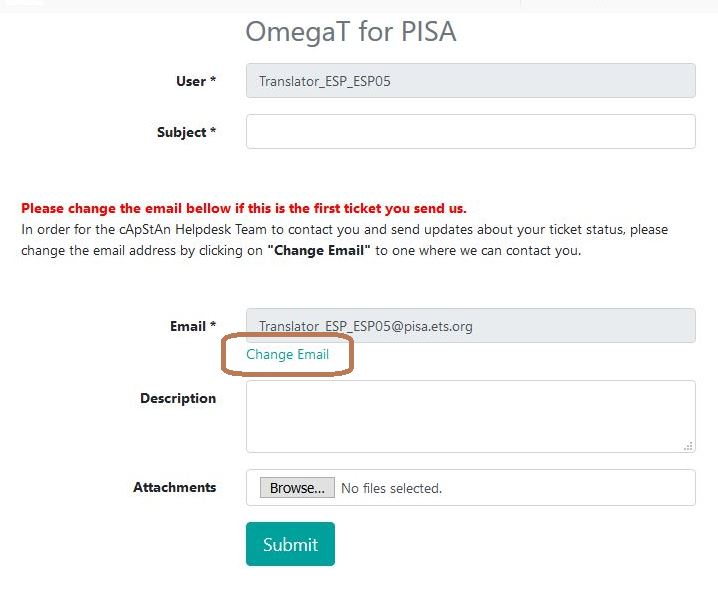
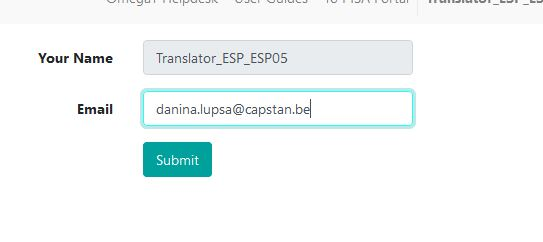
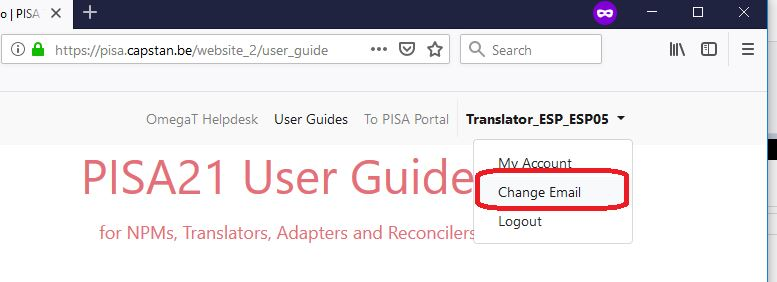
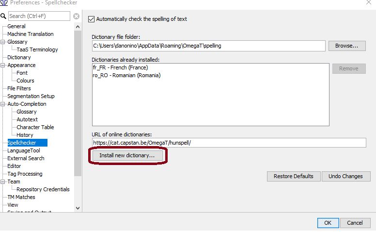
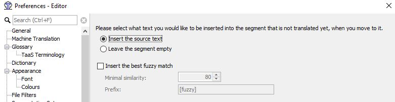
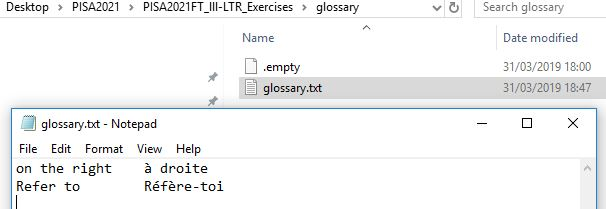
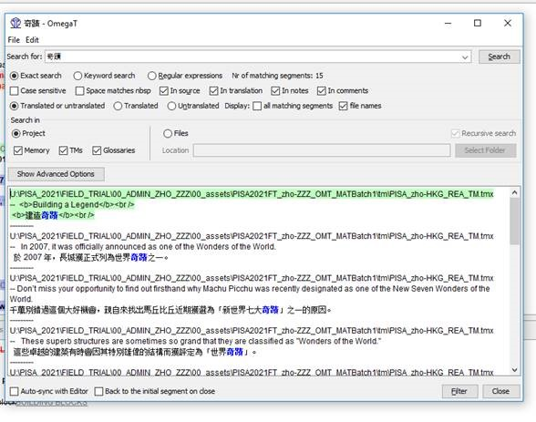

# FAQ

<!--
## [ALL] How can I contact the helpdesk ?

To contact the OmegaT helpdesk for OmegaT related questions:

  * go to [https://pisa.capstan.be](https://pisa.capstan.be) (if you work on PISA) or [https://piaac.capstan.be](https://piaac.capstan.be) (if you work on PIAAC)

  * Click on **Sign in** on the top right corner
  * Press **Log in with PISA-ETS** (if you work on PISA) or **Log in with PIAAC-ETS** (if you work on PIAAC)

  * Enter your portal credentials (the same ones you use to preview the units on the portal). If you don't have your portal credentials, please contact your NPM or PM (if you are a cApStAn verifier)
  * Click on OmegaT Helpdesk
  * Replace the default email with your real email as explained
  * Explain your issue clearly in the Description field, write a short summary of your issue in the Subject field and attach any files you want to illustrate the issue.

All the above steps are also described in the following
-->

<!-- unnecessary because the "country's version" will always be available in the mapped repo in PISA 2025

## [VER] How can I make sure I always see the country's version in the Fuzzy matches pane ?

Before you make any changes in the project, press ++ctrl+D++ on your keyboard to generate the target files. Then go to **Project>Access project contents>root**.

You will see 3 different translation memories (.tmx) files. Copy the last one ending with "-omegat.tmx" and paste it in the **tm** folder.

-->

<!-- this does not belong in an omegat guide...

## It's been 2 days and I haven't received a notification about a reply to my ticket. Is this normal ?

This is not normal. Our policy is to reply to tickets within a maximum of 48 working hours. If you haven't received a notification, it is possible that you have not changed the e-mail address on the helpdesk. When you send us a ticket please make sure to click on the "Change Email" button.

Replace the fictitious e-mail TRANSLATOR_LLL_00x@project.ets.org with your real e-mail address.

You can also change your e-mail information by click in the top right menu after logging in.

-->

<!-- topic:export -->

## Can I export the contents of the OmegaT project in Excel ?

Yes. To export the contents of the OmegaT project in Excel, go to **Tools** > **Write Project to Excel**.

To access the exported Excel, go to **Project** > **Access Project Contents** > **Root**. The Excel will be found in the **script_output** folder.

<!-- prettier-ignore -->
!!! Предупреждение
    Please remember that the Excel file cannot be reimported in OmegaT. Any change you make in translations in that Excel export needs to be reflected in the OmegaT project.

<!-- topic:font -->

## The size of text in the editor is too small or too big.

To change the font size go to **Options** > **Preferences** > **Font**.
Change the font size to one you find suitable. This has no impact on the actual font size in the target files, it only changes the display in OmegaT.

<!-- topic:checks -->

## How do I install the spellchecker files?

A spelling checker is available in OmegaT and you must install the spellchecking dictionary for your language in order to use it. Follow these steps:

1. Go to **Options > Preferences > Spellchecker**.
2. Click on **Install new dictionary**, and a list of languages will appear.
3. Select the appropriate language for your language version (e.g. _es_AR - Spanish (Argentina)_ if your language is Spanish and your country is Argentina).
4. Press the **Install** button.

You can close the remaining pop up window. The spellchecker is now installed.

<!-- prettier-ignore -->
!!! Совет
    You can also watch the following video to see those steps in action:
    
<iframe src="https://player.vimeo.com/video/780395752?h=5a92c211b3" style="position:absolute;top:0;left:0;width:100%;height:100%;" frameborder="0" allow="autoplay; fullscreen; picture-in-picture" allowfullscreen></iframe>

<!--  -->

<!-- You should see the URL `[https://cat.capstan.be/OmegaT/hunspell/](https://cat.capstan.be/OmegaT/hunspell/)`. -->

<!-- topic:config -->

## There is no spellchecker for my language.

If you cannot find your language in the list when you go to **Options > Preferences > Spellchecker.** and then clicking on **Install new dictionary**, please contact the helpdesk and our team will try to find a spellchecking dictionary for you.

Please note that spellchecking dictionaries might not be available for all languages.

<!-- topic:config -->

## I don't have the **Unpack project from OMT file** item.

If you do not see the **Unpack project from OMT file** option in the **Project** menu, please follow our OmegaT installation and setup guide (available from the `Installation and setup` section of these guides) and choose the third path ("Version 5.7.1 of OmegaT is already installed in your machine") to install the customization (again).

If you still cannot see the **Unpack project from OMT file** option after doing that, please contact the Helpdesk.

<!--
## When I translate, I like to overwrite the source text with the target. Can I insert the source text in the target segment automatically and then start translating?

The answer is yes. To do so, go to **Options>Editor** in OmegaT. Then tick the option "Insert the source text" and press OK.

In OmegaT, when you navigate from one segment to another, the source text will be automatically inserted each time.
-->

<!-- topic:glossary -->

## How can I correct a typo in a term in the glossary?

Yes. Please follow these steps:

1. Go to **Project > Access Project contents > Glossaries** to access your writeable glossary file. The `Glossaries` folder will open, which contains a file named `glossary.txt`.
2. Open it in your plain text editor (e.g. Notepad):

    

3. Correct any term that contains an error and Save the file.

<!-- prettier-ignore -->
!!! Предупреждение
    Do not open the glossary file in Microsoft Word or any other similar word processor.

<!-- topic:TMs -->

## Do we have access to the TMs from previous cycles?

Yes. TMs (translation memories) from previous cycles should already be included in your project. You may see translations coming from them in the **Matches** pane, or you may find them by running a text search (see the relevant section in the guide, under **Other useful features** > **Running concordance searches**).

You may also access translations from all previous cycles of the project for your language in [MemoryLn](https://capps.capstan.be/memoryln.php).

<!-- prettier-ignore -->
!!! info
    If you don't see the expected translations in your OmegaT project and in MemoryLn, please contact the Helpdesk.

<!--
## Is it possible to access MemoryLn with a translator account?

The answer is yes. MemoryLn can be accessed by logging in to the portal. If you have portal credentials you can access MemoryLn for your language by default, independently of the role you have in the project.
-->

<!-- topic:export -->

## Can I work in Trados or another CAT tool?

The answer is no. OmegaT is specifically customized to edit the files you are working on. Such a customization is not possible in Trados or memoQ. Removing the files from the OmegaT project and translating them separately may damage the files and render them unusable for further use.

<!-- topic:search -->

## How can I find translations searching by the target text?

Proceed as follows:

1. Press ++ctrl+f++ on your keyboard. The search dialog opens.
2. Type the text in the target language that you want to find.
3. Check option "In translation" in the search dialog
4. Press the **Search** button.

<!-- topic:x -->

## I only see one 100% match when I am reconciling.

If you matches are identical, only one of them will be displayed in the Matches pane to avoid space-consuming duplicates. If you only see one translation in the Matches pane during the reconciliation task, that means the two translators have proposed the exact same translation. Next to the 100% match you will also notice it is written "+1 more".

<!--
## Why is my OMT package rejected in the portal and how I can fix it?

It is required that all segments are translated at the end of both translation and reconciliation tasks. To ensure this is the case, uploaded projects are checked for completion in every workflow step when you try to finish the task. If it is detected that some segments are not translated in the project, it is not possible to finish the task.

How do you know whether all segments are translated in your project? You can go to **Tools > Statistics** to obtain a report of the project statistics. If the "Remaining" or "Unique remaining" rows do not show "0", that means that some segments are not translated. Also, if you press shortcut ++ctrl+u++, OmegaT will open the next untranslated segment.

How can you fix this? You guessed it! Translate all remaining segments, then export the OMT package again, upload it again and then try to finis the task again.
-->

<!-- todo:
- move the search to its own section
-->
